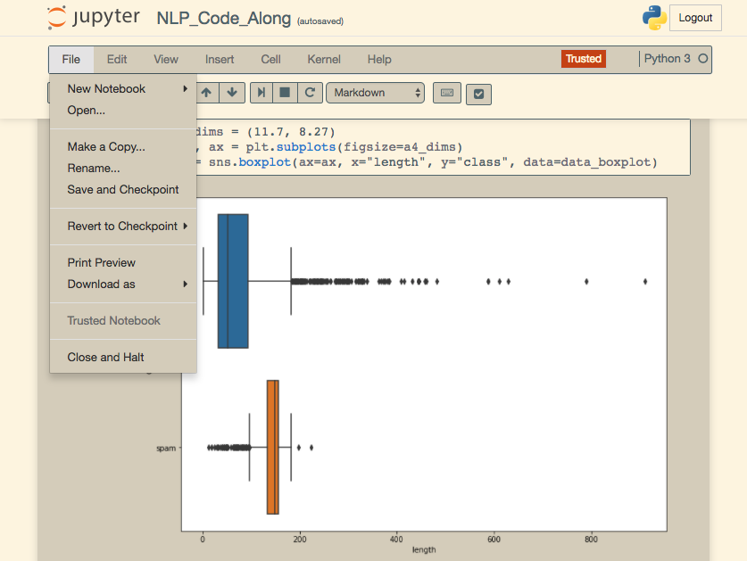

# Jupyter Notebook Solarized Light Theme

I created the theme because I'm color blind and I found that my eyes were going tired in about two hours of coding and sometimes feeling pain. After trying many different themes I realized that with the Solarized Light theme I was coding longer hours without pain or feeling tired. The theme itself doesn't make me see better the colors, but rather rest and no pain during coding time.

### Installation

To install the theme you need to...

- Create folder `~/.jupyter/custom/`.
- Create file `~/.jupyter/custom/custom.css`. You can not change folder name or file name. Jupyter is looking for a folder called `custom` and a file called `custom.css`.

I have been adding style as I work in different notebooks. I don't know if I have finished styling or something is missing. If you decide to install the theme and you find out that some style is missing, please create a PR or open an issue. 

If you are a developer that uses Jupyter Notebook on a regular basis and you like Solarized Light; enjoy the theme. If you are color blind and you are looking for some alternative that keeps you coding for longer hours, hopes this helps.
